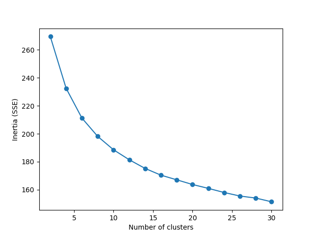
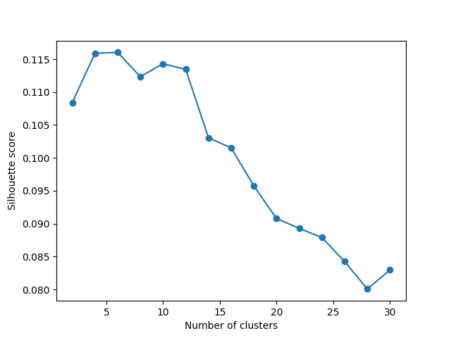

## テキストデータの手動解析
- 対象カラム
  - `"name", "desc", "keywords"`
- 書籍は国際十進分類法で分類したい
```
    0 総記
    1 哲学、心理学
    2 宗教、神学
    3 社会科学
    4 （未定義）
    5 自然科学、数学
    6 応用科学、医学、工学
    7 芸術
    8 言語、文学
    9 地理、伝記、歴史
```

- `"desc"`
  - 見た感じ、書籍やCDの販促っぽい内容が多い印象。以下、trainデータの１行目から順に、ジャンルを書いてみる
  - 理想はメディア形態(book, CD, ..)と小分類（人文、社会科学、自然科学、文学、・・・）に分類して特徴量にすること
  1. 書籍、社会科学
  2. 書籍、自然科学
  3. 音楽
  4. 書籍？、文学
  5. 起業（ベーカリー
  6. 書籍、文学
  7. 音楽
  8. 音楽
  9. 音楽
  10. 音楽
  11. 音楽
  12. 書籍、社会科学
  13. よくわからん
  14. 書籍、芸術
  15. 書籍、文学
  16. 多分書籍、文学
  17. 音楽
  18. 音楽
  19. 音楽
  20. 音楽
  21.
    ...
  - 音楽にはsong, music などマーカになりそうな単語がある
  - 書籍、起業は汎用的なマーカーがないため、LLMの力を借りたい気がする
  - 以下の手順で処理し、テキストをクラスタリングしたところ、概ね書籍等と音楽で分類できた
    1. トークン化（`SentenceTransformer`、モデルは`all-MiniLM-L6-v2`）
        - いくつかのモデルでトークン化して、以降の次元圧縮をしてやると良さそう
    2. 主成分分析
    3. クラスタリング（KMeans）
  - クラスタリングの結果は以下の通り

    | pred | manual_label |
    |------|--------------|
    | 2    | 書籍         |
    | 0    | 書籍         |
    | 1    | 音楽         |
    | 2    | 書籍         |
    | 0    | 起業         |
    | 2    | 書籍         |
    | 1    | 音楽         |
    | 1    | 音楽         |
    | 1    | 音楽         |
    | 1    | 音楽         |
  - テキストから生成されたベクトルのクラスタリング結果によると、最適なクラスタ数はおよそ12だと判明

    
    

  - 以下、クラスタごとのおおまかなイメージ（パス：`../output/04__EDA/0814__text_clustering`）
    - 1. ノンフィクション書籍
    - 2. 飲食ビジネスの起業
    - 3. フィクション書籍
    - 4. イベント・芸術活動支援
    - 5. 音楽活動サポート（制作）
    - 6. マルチメディア（映像作品＋α）
    - 7. オンラインゲーム
    - 8. ソフトウェア、アプリケーション
    - 9. ちょっとよくわからない。イベント？アオリ文のような雰囲気
    - 10. メーカー系起業
    - 11. アート系
    - 12. 映像作品
    - 13. 食品開発
  - 予測クラスタラベルも合わせて特徴量としてモデル学習・予測を実行した(`/output/04__ML/02__validation/0815_0014`)
    - 劇的な変化はなし
    - ラベルごとにモデルを変えるくらいしないと変化しないかも
  - pca の寄与率を可視化したところ、主成分を100くらい追加しない累積寄与率80%くらいにならない
  - ２つのテキストトークナイザモデル（）を試したが、結合したところで対して情報量は増えなかった